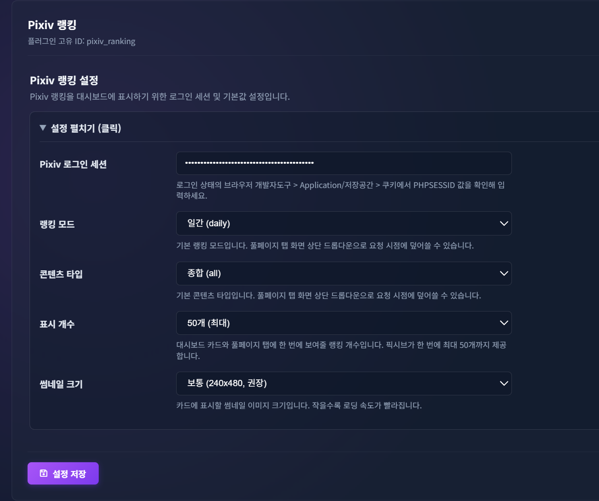

# Pixiv 랭킹 (pixiv_ranking)

BookOasis 카테고리 탭에 픽시브(Pixiv) 랭킹을 카드 형태로 보여주는 메타데이터 플러그인입니다.
검색/적용(search/apply) 기능은 없고, **카테고리 풀페이지 탭 전용**입니다.

---

## 스크린샷

| 메인 화면 (카테고리 풀페이지 탭) | 설정 화면 |
| :---: | :---: |
|  |  |

---

## 주요 기능

- 픽시브 랭킹(일간/주간/월간/신인/오리지널/AI생성/남자에게 인기/여자에게 인기)을
  콘텐츠 타입(종합/일러스트/우고이라/만화)별로 조회
- 좌측 카테고리 메뉴의 풀페이지 탭 (`category_tab`)에 노출
- 풀페이지 탭 화면 상단에서 콘텐츠 타입 / 랭킹 모드를 드롭다운으로 즉시 변경 가능
- 썸네일 이미지는 로컬에 저장하지 않고, 요청 시점에 서버가 픽시브에서 직접 받아
  base64 데이터 URI로 변환해 응답에 실어 보냄 (브라우저 직접 요청 시 발생하는
  Referer 누락 403 문제를 서버 사이드 프록시로 우회)
- 각 단계(설정 로드 → 랭킹 조회 → 썸네일 수집 → 완료)마다 서버 로그와 브라우저
  콘솔에 진행 상황을 남김

---

## 설치

1. 이 폴더 전체를 서버의 `plugins/metadata/pixiv_ranking/`에 그대로 복사합니다.
2. 서버를 재시작합니다.
3. 환경설정 > 플러그인 설정에서 **Pixiv 랭킹**을 활성화합니다.
4. 아래 설정값을 입력하고 저장합니다.
5. 카테고리 메뉴 화면에서 카드가 보이는지 확인합니다.

---

## 설정값

| 키 | 설명 | 필수 |
| :--- | :--- | :--- |
| `PHPSESSID` | 픽시브 로그인 세션 쿠키. 로그인 상태의 브라우저 개발자도구 > Application/저장공간 > 쿠키에서 확인 | 필수 |
| `MODE` | 랭킹 모드 기본값 (daily/weekly/monthly/rookie/original/daily_ai/male/female) | 기본값 daily |
| `CONTENT` | 콘텐츠 타입 기본값 (all/illust/ugoira/manga) | 기본값 all |
| `LIMIT` | 한 번에 보여줄 랭킹 개수 (10/20/30/50) | 기본값 50 |

`MODE`/`CONTENT`는 화면 상단 드롭다운으로 요청 시점에 덮어쓸 수 있습니다
(드롭다운을 조작하지 않으면 위 설정값이 그대로 사용됩니다).

---

## 파일 구성

```text
pixiv_ranking/
  __init__.py       # 플러그인 클래스 export
  pixiv_ranking.py  # 플러그인 본체 (search/apply, dashboard_widget, category_tab)
  VERSION           # 자동 업데이트용 버전 파일 ("plugin version" 키)
  index.html        # 카테고리 풀페이지 뷰 마크업
  style.css         # 카테고리 풀페이지 뷰 스타일
  script.js         # 카테고리 풀페이지 뷰 동작 (데이터 요청, 렌더링, 드롭다운 처리)
  settings.html     # 환경설정 커스텀 폼 (평소엔 접혀 있다가 클릭 시에만 펼쳐짐)
  settings.css      # 환경설정 커스텀 폼 스타일
```

`settings.html`이 있으면 `config_schema` 기반 코어 자동 생성 폼 대신 이 커스텀 폼이 사용됩니다.
`settings.js`와 `requirements.txt`는 사용하지 않습니다 — 값 저장은 `input`/`select`의 `name` 속성이
설정 키(`PHPSESSID`/`MODE`/`CONTENT`)와 일치하면 코어가 자동으로 처리하고, 외부 파이썬 패키지
의존성도 없습니다(표준 라이브러리만 사용).

---

## 동작 방식 요약

1. `get_dashboard_data(db_type, limit)` 호출 시, 설정값(`PHPSESSID`/`MODE`/`CONTENT`)을 불러옵니다.
2. 풀페이지 탭에서 드롭다운으로 `mode`/`content` 쿼리 파라미터가 함께 전달되면
   (`/api/media/dashboard/widgets/pixiv_ranking/data?...&mode=...&content=...`)
   설정값보다 그 값을 우선 사용합니다.
3. 픽시브 랭킹 JSON(`ranking.php?...&format=json`)을 조회합니다.
4. 각 항목의 썸네일을 최대 5개씩 동시에(`ThreadPoolExecutor`) 받아 base64 데이터 URI로 변환합니다.
5. 코어 카드 렌더러가 읽는 `cover/title/author/publisher/link` 필드(및 `image`/`url` 등 별칭)로
   묶어 반환합니다.

---

## 알려진 제약 / 확인이 필요한 부분

- **드롭다운 → 백엔드 값 전달 방식이 비공식입니다.** `get_dashboard_data(self, db_type, limit=10)`
  시그니처에 `mode`/`content`를 받을 자리가 없어서, `flask.request.args`로 현재 요청의 쿼리
  파라미터를 직접 읽는 방식으로 우회했습니다. 코어가 실제로 이 값을 그대로 통과시켜주는지는
  서버 로그의 `0/3 설정 로드 완료` 줄에서 `mode=`/`content=` 값이 드롭다운 선택과 일치하는지
  확인해야 합니다.
- **소설(novel) 랭킹은 지원하지 않습니다.** URL 구조와 JSON 스키마가 달라 별도 검증이
  필요해서 제외했습니다.
- **원본(고해상도) 이미지 URL은 참고용 추정치**(`original_url_guess`)로만 제공됩니다.
  원본이 PNG인 작품은 이 변환만으로는 404가 날 수 있습니다.
- **환경설정 화면 레이아웃**은 `settings.html`/`settings.css` 커스텀 폼으로 라벨-입력을 좌우로
  배치했고, 평소엔 `<details>`로 접혀 있다가 클릭 시에만 펼쳐집니다.
- `update_manifest.enabled`는 `False`로 꺼두었습니다. GitHub 리포지토리에 올리신 뒤
  `raw_base_url`을 실제 경로로 바꾸고 `True`로 전환하세요.

---

## 문제 해결

- **카드에 이미지가 안 뜸**: 서버 로그의 `2/3 썸네일 수신 실패` 줄에서 사유(타임아웃/네트워크
  오류)를 확인하세요. `PHPSESSID`가 만료됐을 가능성이 가장 큽니다.
- **랭킹 자체가 안 뜸**: `1/3 랭킹 응답 수신` 로그의 `status`와 응답 앞부분을 확인하세요.
  로그인 세션이 없거나 만료되면 HTML(로그인 페이지)이 내려와 JSON 파싱에 실패합니다.
- **브라우저 콘솔**에서 `[Pixiv-Ranking-Plugin]` 접두사 로그로 요청 URL, 응답 상태, 렌더링된
  개수, 이미지 로드 실패 여부(개별 `` 태그 단위)까지 확인할 수 있습니다.
